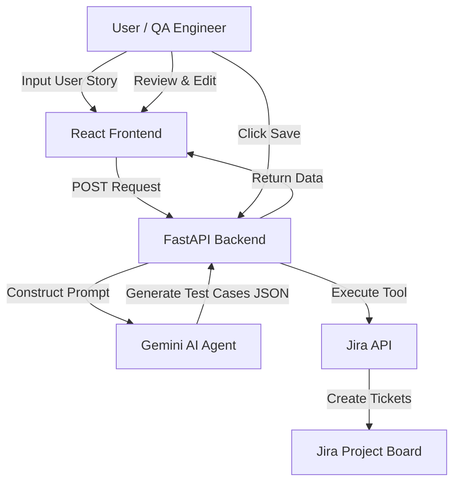

# AI Test Case Generator for Jira

**Accelerate your QA workflow by turning User Stories into comprehensive Test Cases instantly.**

This application acts as an intelligent QA Copilot, leveraging **Google Gemini AI** to analyze Jira User Stories and Acceptance Criteria. It automatically generates detailed positive and negative test scenarios, formatted perfectly for Jira, saving QA teams hours of manual documentation work.

## Key Features

*   **Smart Analysis**: Uses advanced LLMs to understand complex requirements and edge cases.
*   **Instant Generation**: Creates step-by-step test cases with preconditions and expected results in seconds.
*   **Seamless Jira Integration**:
    *   **Sub-task Creation**: Automatically attaches generated test cases as sub-tasks to your existing Jira Stories.
    *   **Smart Linking**: Links test cases directly to parent requirements.
*   **Interactive UI**:
    *   **Edit & Refine**: Manually tweak steps, titles, or results before saving.
    *   **Excel Export**: One-click copy to clipboard for spreadsheet documentation.
    *   **Manual Entry**: Add custom test cases alongside generated ones.
*   **Quality Assurance**: Ensures test coverage includes both "Happy Path" and "Error Handling" scenarios.

## Architecture

The application follows a modern Agentic workflow:



## Technical Implementation (Agent Concepts)

This project demonstrates three key AI Agent concepts:

1.  **Role-Playing & Prompt Engineering**: The AI is instructed to adopt the persona of a "Senior QA Lead," ensuring test cases cover edge cases and security scenarios, not just happy paths.
2.  **Structured Output Enforcement**: The agent is constrained to return strict JSON data, allowing the frontend to render interactive, editable cards rather than unstructured text.
3.  **Tool Use (API Integration)**: The system doesn't just generate text; it acts on the real world by interfacing with the Jira REST API to create linked issues and sub-tasks automatically.

## Project Journey & Learnings

**The Problem**: Manual test case creation is repetitive and prone to human error. QA teams spend more time writing documentation than testing.

**The Solution**: An AI-powered assistant that drafts 80% of the work instantly, allowing humans to focus on the final 20% of refinement.

**Challenges Overfaced**:
*   **Jira API Complexity**: Handling the difference between "Sub-task" and "Subtask" issue types across different Jira configurations required robust error handling and retry logic.
*   **AI Hallucinations**: Early versions of the prompt resulted in inconsistent formatting. We implemented strict Pydantic models and JSON cleaning logic in the backend to ensure reliability.

## Tech Stack

*   **Frontend**: React, TypeScript, Tailwind CSS
*   **Backend**: Python, FastAPI
*   **AI Model**: Google Gemini Pro
*   **Integration**: Jira REST API

## Setup & Installation

### Prerequisites
*   Node.js (v16+)
*   Python (v3.9+)
*   Jira Account (URL, Email, API Token)
*   Google Gemini API Key

### Backend Setup
1.  Navigate to the backend directory:
    ```bash
    cd backend
    ```
2.  Create a virtual environment and activate it:
    ```bash
    python -m venv venv
    # Windows
    .\venv\Scripts\activate
    # Mac/Linux
    source venv/bin/activate
    ```
3.  Install dependencies:
    ```bash
    pip install -r requirements.txt
    ```
4.  Create a `.env` file in the `backend` folder with your credentials:
    ```properties
    GOOGLE_API_KEY=your_key
    JIRA_URL=your_jira_url
    JIRA_EMAIL=your_email
    JIRA_API_TOKEN=your_token
    ```
5.  Run the server:
    ```bash
    uvicorn app.main:app --reload
    ```

### Frontend Setup
1.  Navigate to the frontend directory:
    ```bash
    cd frontend
    ```
2.  Install dependencies:
    ```bash
    npm install
    ```
3.  Start the application:
    ```bash
    npm start
    ```

## License

This project is licensed under the MIT License.
